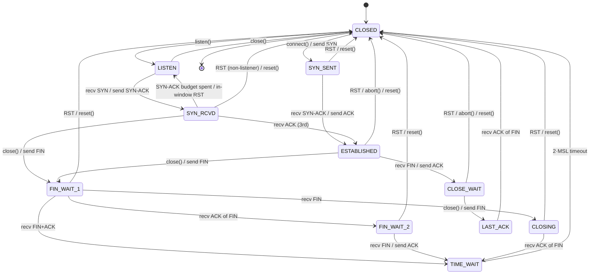
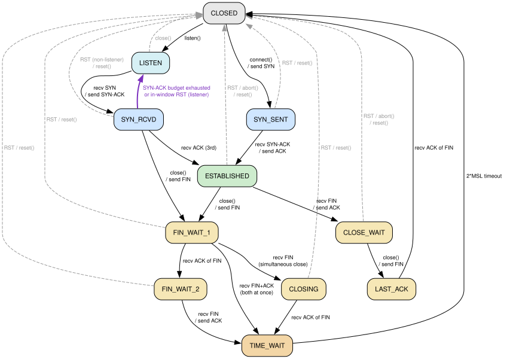

# Connection state machine

The eleven TCP states (RFC 9293 §3.3.2) and every transition this stack can
take. The graph is **implementation-accurate**: its edges are exactly the
relation enforced by `allowed_transition()` in
[`fuzz/fuzz_targets/tcb_client_session.rs`](../fuzz/fuzz_targets/tcb_client_session.rs),
which panics if the live TCB ever makes a move not drawn here — so the picture
and the running oracle cannot drift apart. The state enum is in
[`src/state.rs`](../src/state.rs); the transition sites are in
[`src/tcb.rs`](../src/tcb.rs).

The diagram below is also committed as Graphviz
([`state-machine.dot`](state-machine.dot) →
[`state-machine.svg`](state-machine.svg)); the Mermaid copy renders inline on
GitHub with no build step.



Graphviz render (same graph, higher fidelity — dashed grey = abort edges,
bold purple = the SYN_RCVD → LISTEN revert):



## Transitions

| From | To | Trigger | Action | Code |
| --- | --- | --- | --- | --- |
| CLOSED | SYN_SENT | `connect()` | send SYN | `Tcb::connect` |
| CLOSED | LISTEN | `listen()` | — | `Tcb::listen` |
| LISTEN | SYN_RCVD | recv SYN | send SYN-ACK | `on_segment_listen` |
| LISTEN | CLOSED | `close()` | — (local) | `Tcb::close` |
| SYN_SENT | ESTABLISHED | recv SYN-ACK | send ACK | `on_segment_syn_sent` |
| SYN_SENT | CLOSED | recv RST / `reset()` | surface `ConnectionReset` | `handle_rst` / `reset` |
| SYN_RCVD | ESTABLISHED | recv 3rd ACK | — | `on_segment_syn_rcvd` |
| SYN_RCVD | LISTEN | SYN-ACK retransmit budget exhausted, or in-window RST | recycle the half-open slot | `tick` / `handle_rst` → `reset_to_listen_or_closed` |
| SYN_RCVD | FIN_WAIT_1 | `close()` | send FIN | `Tcb::close` |
| SYN_RCVD | CLOSED | recv RST (non-listener) / `reset()` | surface `ConnectionReset` | `handle_rst` |
| ESTABLISHED | FIN_WAIT_1 | `close()` | send FIN | `Tcb::close` |
| ESTABLISHED | CLOSE_WAIT | recv FIN | send ACK | `advance_state_on_remote_fin` |
| ESTABLISHED | CLOSED | recv RST / `abort()` / `reset()` | surface `ConnectionReset` | `handle_rst` / `abort` |
| FIN_WAIT_1 | FIN_WAIT_2 | recv ACK of our FIN | — | `process_ack` |
| FIN_WAIT_1 | CLOSING | recv FIN (simultaneous close) | send ACK | `advance_state_on_remote_fin` |
| FIN_WAIT_1 | TIME_WAIT | recv FIN+ACK in one segment | send ACK, arm 2·MSL | `process_ack` + `advance_state_on_remote_fin` |
| FIN_WAIT_2 | TIME_WAIT | recv FIN | send ACK, arm 2·MSL | `advance_state_on_remote_fin` |
| CLOSING | TIME_WAIT | recv ACK of our FIN | arm 2·MSL | `process_ack` |
| TIME_WAIT | CLOSED | 2·MSL timeout | free the slot | `tick` |
| CLOSE_WAIT | LAST_ACK | `close()` | send FIN | `Tcb::close` |
| LAST_ACK | CLOSED | recv ACK of our FIN | free the slot | `process_ack` |

## Notable, non-textbook edges

- **SYN_RCVD → LISTEN** (bold purple). The stateful passive path keeps at most
  one half-open slot. Each SYN-ACK is retransmitted at most
  `MAX_SYN_RCVD_RETRIES` times; once that budget is spent — or an in-window RST
  arrives — the slot is recycled straight back to LISTEN instead of leaking.
  This is the whole flood-resistance argument for the non-cookie path, and the
  reason the loopback fuzzer withholds chaos until both ends are ESTABLISHED (a
  dropped third ACK that trips this revert is a legitimate half-open, not a
  deadlock). With a SYN-cookie secret set, this slot is stateless instead.
- **FIN_WAIT_1 → TIME_WAIT** (direct). When a single segment both ACKs our FIN
  and carries the peer's FIN, the two single-step edges collapse into one. The
  oracle's `allowed_transition` permits it explicitly.
- **Abort edges → CLOSED** (dashed grey). A received RST (validated in-window
  per RFC 5961), a local `abort()`, or a host `reset()` can drop almost any
  synchronized state to CLOSED. Drawn from the representative states to keep the
  graph legible.

## Regenerating the SVG

After editing [`state-machine.dot`](state-machine.dot):

```sh
dot -Tsvg docs/state-machine.dot -o docs/state-machine.svg
```

Keep the `.dot` edges in lockstep with `allowed_transition()` — if you add a
real transition, update both, or the fuzzer will reject the new move (or the
diagram will lie).
